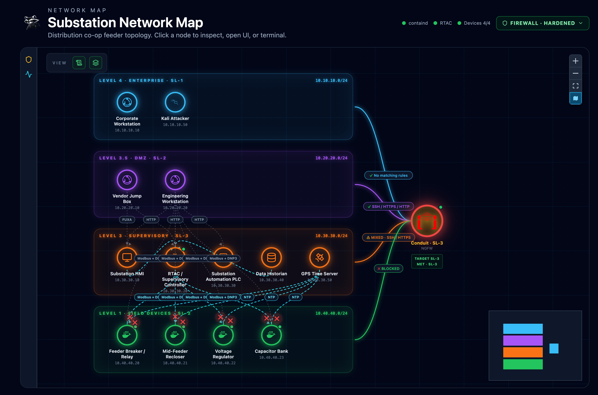
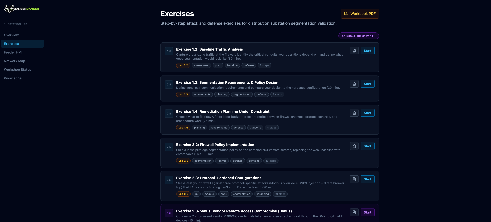
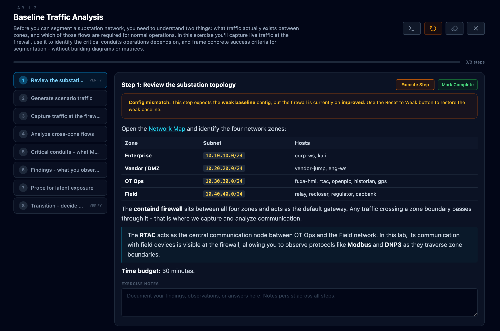
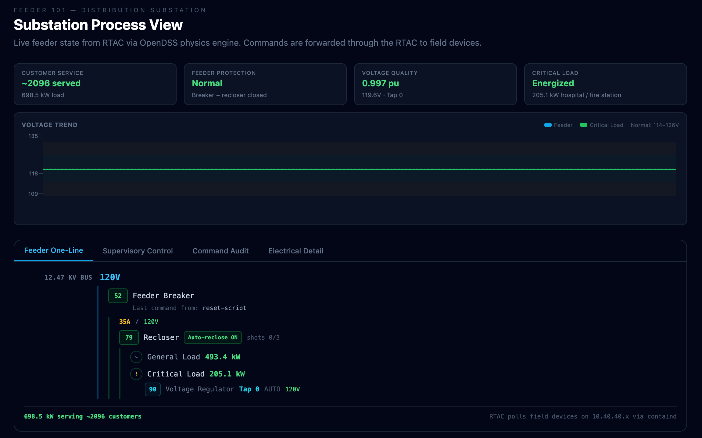
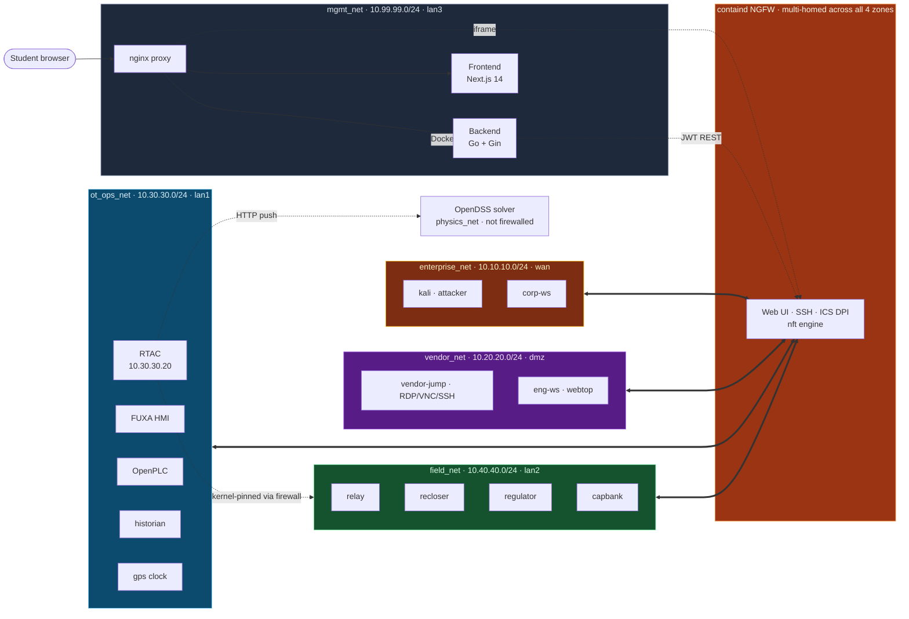

<div align="center">
  
  <br>
  <strong>An interactive OT segmentation training environment for electric substation security.</strong>
</div>

<p align="center">
  <a href="https://github.com/tonylturner/rangerdanger/actions/workflows/ci.yml"></a>
  <a href="https://github.com/tonylturner/rangerdanger/releases"></a>
  <a href="https://opensource.org/licenses/Apache-2.0"></a>
  <a href="https://go.dev"></a>
  <a href="https://nextjs.org"></a>
  <a href="https://docs.docker.com/compose"></a>
  <a href="https://github.com/tonylturner/containd"></a>
</p>

RangerDanger teaches network segmentation by putting students inside a working electric distribution substation. The whole experience runs in a single web portal: an interactive topology map shows the zones and devices, clicking a node opens its container terminal in the browser, structured exercises walk through each lab step-by-step with live validation, and a process view shows how cyber actions actually change voltages, breaker states, and load energization in real time. The firewall at the center is [containd](https://github.com/tonylturner/containd), a purpose-built NGFW with ICS deep-packet inspection, so students see and control Modbus function codes, DNP3 Direct Operate commands, and per-zone policy decisions the way modern OT-aware firewalls actually surface them.

7 labs aligned to the DefendICS OT Network Segmentation workshop deck: identify required flows, design segmentation, plan under a labor budget, build the policy, stress-test it against a DNP3 Direct Operate injection (with optional Modbus sidebar attacks), validate with PCAP evidence.

> **Lab-only.** All host ports bind to loopback by default. No auth on terminals or the backend. Default credentials are baked in. Do not connect to production. See [`SECURITY.md`](SECURITY.md) for the full model and safe external-access patterns.

## What you get

- **Interactive topology map** at `/console`. IEC 62443 zone bands (Enterprise SL-1, DMZ SL-2, Supervisory SL-3, Field SL-2) with a live policy overlay that shows which conduits are allowed or blocked under the active firewall config. Click any node to inspect device state, open its web UI, or drop into a terminal. Drawers surface protocol details and live traffic context per node.
- **Embedded container terminals**. xterm.js plus WebSocket exec into every lab container. No SSH client, no port forwards. Terminal state persists across navigation via a shared React context, and PTY size propagates so `stty` queries return the right values.
- **Exercise runner** at `/exercises/[id]`. Each lab is a step-by-step walk-through with inline command blocks (one-click run), persistent per-exercise notes, and live state-reading validators that show green/red chips as students hit checkpoints. Selections in earlier labs rewrite the steps you see in later ones.
- **Process view** at `/substation`. Live feeder state from the RTAC via the OpenDSS power-flow solver. Modbus FC5/FC6 writes and DNP3 CROB attacks measurably change breaker positions, regulator taps, voltages, and load energization within ~3 seconds. Customer-service tile shows how many customers and how much critical load (hospital, fire station) is currently energized.
- **containd NGFW integration**. ICS-aware NGFW at the conduit. Modbus function-code filtering, DNP3 protocol awareness, IT-side DPI for TLS/SNI, HTTP, RDP. Students apply policy from the lab UI; containd's full web console is iframed at `/containd/` for direct inspection of rules, audit log, and session state.
- **Knowledge wiki** at `/knowledge`. Curated reference for substation equipment, ICS protocols, segmentation patterns, and the lab's specific architecture. Searchable, markdown-rendered, useful both during exercises and afterward.
- **Modbus and DNP3 simulators**. Every field device (relay, recloser, regulator, capacitor bank, RTAC) speaks Modbus TCP, DNP3 TCP, and HTTP simultaneously against shared state. Attacks work via any of the three protocols.
- **PCAP capture and change-board evidence**. Capture cross-zone traffic at the firewall during attack and validation runs. `scripts/validation-report.sh` assembles a ready-to-review evidence package (probe matrix, policy fingerprint, PCAP source analysis) from a clean run.
- **Validation-driven exercises**. Per-lab Go validators read live simulator state, electrical readings, audit log entries, and active firewall config. Green/red feedback is per-checkpoint, no instructor-side grading required.

## Student journey

Each lab builds on the previous. Selections in early labs flow into later ones; your Lab 1.4 remediation plan rewrites the steps you see in Labs 2.2, 2.3, 2.3-bonus, and 2.4. ≈135 minutes for the six core labs (1.2 / 1.3 / 1.4 / 2.2 / 2.3 / 2.4), plus 15 minutes for the optional 2.3-bonus.

| Step | Lab | What you do |
|---|---|---|
| 1 | **1.2 Baseline** | Capture cross-zone traffic at the firewall. Build a flow inventory. Probe for latent exposure that passive monitoring missed. |
| 2 | **1.3 Requirements** | Translate findings into a zone-pair rule grid. Pick BLOCK / RESTRICT / ALLOW per direction. Anchor the design to operational requirements. |
| 3 | **1.4 Plan** | Choose which findings to fix first under a finite labor budget. Per-role utilization updates in real time as you pick actions. |
| 4 | **2.2 Implement** | Build a least-privilege containd policy from your plan. CLI and web UI walkthroughs both supported; the lab adapts to which actions you selected in 1.4. |
| 5 | **2.3 Harden** | Stress-test against a DNP3 Direct Operate injection that disables auto-reclose and trips the recloser — the canonical distribution-substation attack vector. Watch the process view as voltages drop, breakers open, downstream loads de-energize. Re-test under the hardened policy. Optional Modbus FC5/FC6 sidebars cover the same defense pattern. |
| 5b | **2.3-bonus** | Optional kill-chain exercise: vendor RDP/VNC pivot from enterprise to vendor to field. Demonstrates both the perimeter rule and defense-in-depth. |
| 6 | **2.4 Validate** | Capture PCAP under the hardened policy. Assemble change-board evidence. Confirm attacks fail and authorized flows still work. |

## Quick start

**Prereqs:** Docker Desktop or Docker Engine + Compose v2 · 16 GB host RAM (32 recommended) with at least 8 GB allocated to the Docker VM · 30 GB free disk · Apple Silicon or x86_64 · loopback ports `8088 / 9080 / 9443 / 2222` free.

**macOS / Linux:**

```bash
git clone https://github.com/tonylturner/rangerdanger
cd rangerdanger
./setup.sh
```

**Windows (PowerShell):**

```powershell
git clone https://github.com/tonylturner/rangerdanger
cd rangerdanger
.\setup.ps1
```

**Build from source instead** (developers):

```bash
docker compose up -d --build
```

**Offline / SSD** (for workshops where bandwidth is constrained):

```bash
./setup.sh --from-tarballs /Volumes/WORKSHOP_SSD
```

Use `./stage-ssd.sh /Volumes/WORKSHOP_SSD vX.Y.Z` to populate the SSD, or grab the per-release tarballs from [GitHub releases](https://github.com/tonylturner/rangerdanger/releases). Full install walkthrough including the offline path and common errors: [`docs/quickstart.md`](docs/quickstart.md). Workshop operators running multi-laptop classroom deployments: [`docs/workshop-ssd.md`](docs/workshop-ssd.md) covers initial staging, mid-workshop delta patches, and recovery.

Once the stack is up:

| | URL | Credentials |
|---|---|---|
| **RangerDanger UI** | http://localhost:8088 | - |
| containd Web UI | http://localhost:9080 | containd / containd |
| containd SSH | `ssh -p 2222 containd@localhost` | containd / containd |
| FUXA HMI | http://localhost:8088/apps/fuxa-hmi/ | - |
| OpenPLC | http://localhost:8088/apps/openplc/ | - |

Open [http://localhost:8088/exercises](http://localhost:8088/exercises) and start with **Lab 1.2**.

## What it looks like

Screenshots in student-journey order. Click any image to view full size.

<table>
<tr>
<td width="340" valign="middle"><a href="docs/images/screenshot-network-map.png"></a></td>
<td valign="middle"><b>Interactive topology console</b> at <code>/console</code>. IEC 62443 zone bands with a live policy overlay. The containd NGFW sits at the conduit; hardened-policy mode marks blocked enterprise-to-field paths with red ✗. Click any node to inspect or open a terminal.</td>
</tr>
<tr>
<td width="340" valign="middle"><a href="docs/images/screenshot-exercises.png"></a></td>
<td valign="middle"><b>Exercise dashboard</b> at <code>/exercises</code>. 7 labs aligned to the DefendICS deck (1.2 / 1.3 / 1.4 / 2.2 / 2.3 / 2.3-bonus / 2.4). Per-lab progress, time budgets, tag-based filtering, bonus-lab styling.</td>
</tr>
<tr>
<td width="340" valign="middle"><a href="docs/images/screenshot-lab-runner.png"></a></td>
<td valign="middle"><b>Lab runner</b> at <code>/exercises/[id]</code>. Step-by-step instructions, inline command blocks (one-click run), persistent notes, live config-state checks. The yellow banner fires when the firewall is on a config the step doesn't expect, with a one-click reset.</td>
</tr>
<tr>
<td width="340" valign="middle"><a href="docs/images/screenshot-substation-hmi.png"></a></td>
<td valign="middle"><b>Substation process view</b> at <code>/substation</code>. Live feeder state from the RTAC via OpenDSS. When a student attacks a Modbus or DNP3 endpoint, voltage, breaker position, and load energization update here within ~3 seconds. Customer-service tile makes the kinetic consequence visible.</td>
</tr>
</table>

<!--
TODO screenshots still needed - capture after a workshop run and drop into docs/images/:
  - screenshot-dashboard.png         : portal home at / (metric tiles, workshop status, quick links)
  - screenshot-terminal.png          : close-up of an embedded xterm session attached to kali-1 mid-attack
  - screenshot-containd-policy.png   : the proxied /containd/ view showing applied rules
  - screenshot-validation.png        : a lab runner step with the green/red validation chips visible
Insert into the table above when ready, with similar inline captions.
-->

## Designed for

RangerDanger is designed for instructors and security teams who need reviewable lab content, offline classroom delivery, and hands-on segmentation work that students can validate themselves.

- **Fully open and auditable.** Apache 2.0 source for the backend (Go), frontend (TypeScript), simulators, and lab content. No closed binaries, no behavior that can't be inspected in the repo. Suitable for organizations whose security posture requires source review before a tool runs on student laptops.
- **Source-controlled lab content.** Every exercise lives as YAML in [`lab-definitions/scenarios/`](lab-definitions/scenarios/). Forkable, diff-reviewable, instructor-customizable: replace the substation scenario with a water-treatment or manufacturing variant, retune the labor-budget model in Lab 1.4, or rewrite the validators against your own state machine.
- **Offline / SSD workshop-ready.** [`stage-ssd.sh`](stage-ssd.sh) produces a complete tarball bundle for an offline classroom; [`setup.sh --from-tarballs`](setup.sh) brings the stack up with no network. Patch tooling ([`stage-ssd-delta.sh`](stage-ssd-delta.sh)) lets you ship a fix mid-workshop as a tens-of-MB delta instead of re-shipping the full 6 GB.
- **Segmentation and DPI-policy focused.** The firewall is the protagonist. Every lab walks toward a least-privilege containd policy with ICS DPI; the topology console shows policy state in real time; validators read active policy and audit log alongside simulator state.
- **Physics-backed.** Attacks have measurable kinetic consequences via the OpenDSS power-flow solver. Modbus FC5/FC6 writes and DNP3 CROB commands change breaker positions, regulator taps, voltages, and load energization within ~3 seconds, surfaced in the substation process view.
- **Native multi-architecture where the upstream supports it.** 13 of 14 first-party images ship `linux/amd64` and `linux/arm64` native builds. Apple Silicon students do not pay an emulation tax on the lab work itself. OpenPLC is amd64-only upstream and runs under Rosetta on Apple Silicon for the protection-logic lab; cross-included automatically in the arm64 SSD bundle.
- **Designed for classroom delivery.** Single-laptop-per-student with loopback-only host binding, no auth, lab-only credentials, and an explicit security model. Instructor SSD distribution handles bandwidth-constrained venues. The setup-time workshop-readiness gate fails loudly if the stack is half-broken rather than letting students discover it at lab time.

## Why RangerDanger is different

Most OT segmentation labs hand students a PDF workbook, a Wireshark capture, and an iptables-and-vibes firewall. RangerDanger replaces all three with an interactive environment where the firewall is a real ICS-aware NGFW, segmentation decisions show up immediately on the topology map, and attacks against the lab produce measurable changes in the power-flow solver.

| | Generic ICS labs | RangerDanger |
|---|---|---|
| Firewall | iptables or OPNsense | containd NGFW with Modbus / DNP3 / CIP DPI |
| Segmentation work | Static topology, paper matrix | Interactive zone map with live policy overlay, click-to-implement, live deny/allow chips per conduit |
| Attack consequence | Container state changes | Power-flow solver: voltages, currents, breaker positions, load energization update in the process view within ~3 seconds |
| Validation | Instructor walks around checking screens | Per-lab Go validators read live simulator state and audit log; green/red chips per checkpoint, no manual grading |
| Lab content | PDF workbook | Inline command runner, embedded terminals, persistent notes, dynamic content from earlier-lab choices |
| Reference material | "Look it up in the textbook" | Integrated wiki at `/knowledge` with curated substation, protocol, and segmentation articles |
| Evidence | Wireshark exports manually correlated | One-command change-board evidence: probe matrix + policy fingerprint + PCAP source analysis |
| Distribution | Bring-your-own VMs | Single `docker compose up -d` or `setup.sh --from-tarballs` for offline workshops; runs on a laptop |

## Architecture at a glance

A Next.js dashboard fronts a Go + Gin backend that orchestrates Docker containers, talks to containd over REST, and runs the scenario validators. Field-device simulators implement Modbus TCP + DNP3 TCP + REST against shared state, with OpenDSS providing feeder physics. Five network zones plus a management plane; all cross-zone traffic transits the containd firewall, including RTAC-to-field, kernel-pinned via `rtac-harden.sh` so the multi-homed RTAC can't bypass policy.



Full breakdown including node IPs, service interactions, the RTAC kernel-pinning compensating control, and a deeper Docker-architecture diagram: [`docs/architecture.md`](docs/architecture.md) and [`docs/architecture-diagram.md`](docs/architecture-diagram.md).

## Documentation

Start at [`docs/`](docs/) for the routed landing page. Key entries:

| | |
|---|---|
| 📚 [`docs/README.md`](docs/README.md) | Documentation landing page - routes by audience (student / instructor / developer / security reviewer) |
| 📦 [`docs/quickstart.md`](docs/quickstart.md) | Full install walkthrough including offline/SSD path |
| 💾 [`docs/workshop-ssd.md`](docs/workshop-ssd.md) | Operator runbook: SSD distribution + mid-workshop delta patches |
| 🏗 [`docs/architecture.md`](docs/architecture.md) | Zone model, node inventory, service interactions, data flow |
| 🎓 [`docs/workshop-overview.md`](docs/workshop-overview.md) | Lab-by-lab walkthrough: what's simulated and what isn't |
| 📝 [`docs/lab-authoring.md`](docs/lab-authoring.md) | How to write a workshop lab (YAML shape, fences, decisions) |
| 🔌 [`docs/api-spec.md`](docs/api-spec.md) | REST + WebSocket reference |
| 🔐 [`SECURITY.md`](SECURITY.md) | Lab security model, external-access patterns, vuln reporting |
| 🐛 [`docs/security-known-issues.md`](docs/security-known-issues.md) | Triaged govulncheck/Trivy findings with rationale |
| 🛠 [`CONTRIBUTING.md`](CONTRIBUTING.md) | Local dev setup, tests, PR conventions |
| 🗺 [`ROADMAP.md`](ROADMAP.md) | Planned v0.2.0 + v0.3.0 + backlog |
| 💬 [`SUPPORT.md`](SUPPORT.md) | Where to ask questions and what to expect |
| 📜 [`CHANGELOG.md`](CHANGELOG.md) | Per-release notes |

## Related projects

- **[containd](https://github.com/tonylturner/containd)** - The ICS-aware NGFW at the heart of the lab
- **[`dnp3go/`](dnp3go/)** - Zero-dependency Go DNP3 library used by the field-device simulators (standalone module vendored in this repo)

## License

Apache License 2.0. See [LICENSE](LICENSE).
