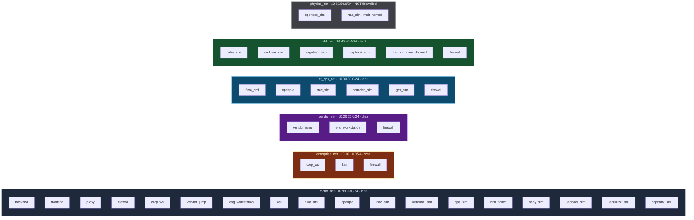
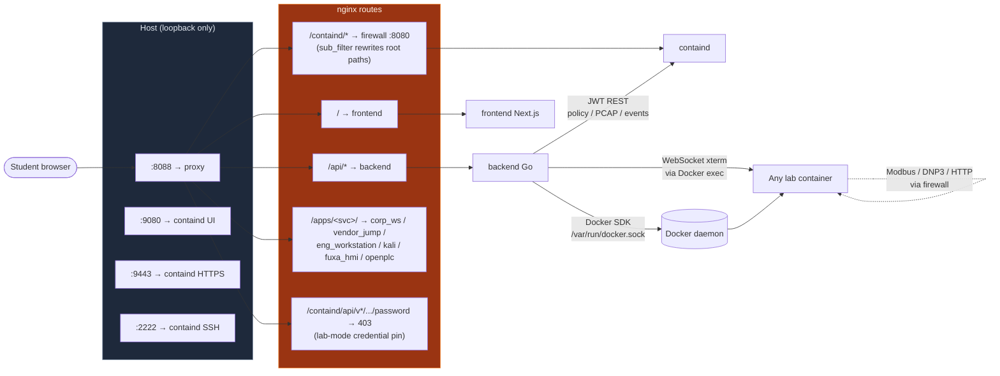

# Docker architecture

How the RangerDanger Docker stack is composed: which services run, which
images are built locally vs pulled, which Docker networks each service
attaches to, and how the proxy wires everything up to the student's
browser.

For the lab/zone story (substation topology, RTAC routing, ICS
protocols, OpenDSS physics) see [`architecture.md`](architecture.md).
For the codebase layout (Go packages, frontend libs) see
[`CONTRIBUTING.md`](../CONTRIBUTING.md).

The SVGs below are pre-rendered from the mermaid source so the
diagrams render in any markdown viewer (GitHub, VS Code, mkdocs,
PDF export). The source blocks are kept in collapsed `<details>` so
edits stay diff-friendly. To regenerate:

```sh
npx --yes @mermaid-js/mermaid-cli -t dark -b transparent \
  -i source.mmd -o docs/images/diagram-name.svg
```

---

## Compose stack - services, images, dependencies

Every box is a `docker-compose.yml` service. `build:` services build
locally from a Dockerfile in this repo; `image:` services pull from a
public registry. Arrows are `depends_on` (solid = `service_started`,
dashed = `service_healthy`).

```mermaid
flowchart TB
    classDef built fill:#0c4a6e,stroke:#7dd3fc,color:#e0f2fe
    classDef pulled fill:#581c87,stroke:#c084fc,color:#f3e8ff
    classDef platform fill:#14532d,stroke:#86efac,color:#dcfce7

    subgraph Platform["Platform services (mgmt_net only)"]
        proxy["proxy<br/>nginx:1.27-alpine"]
        backend["backend<br/>build · Dockerfile.backend"]
        frontend["frontend<br/>build · Dockerfile.frontend"]
    end

    firewall["firewall<br/>ghcr.io/tonylturner/containd:latest"]

    subgraph Webtops["Webtop containers (browser-accessible UIs)"]
        corp_ws["corp_ws<br/>linuxserver/webtop"]
        vendor_jump["vendor_jump<br/>build · Dockerfile.vendor-jump"]
        eng_workstation["eng_workstation<br/>build · Dockerfile.eng-ws"]
        kali["kali<br/>build · Dockerfile.kali"]
    end

    subgraph OT["OT layer"]
        fuxa_hmi["fuxa_hmi<br/>frangoteam/fuxa@sha256"]
        hmi_poller["hmi_poller<br/>alpine:3.21"]
        openplc["openplc<br/>build · Dockerfile.openplc"]
        rtac_sim["rtac_sim<br/>build · services/Dockerfile :rtac-sim"]
        historian_sim["historian_sim<br/>build · services/Dockerfile :historian-sim"]
        gps_sim["gps_sim<br/>build · services/Dockerfile :gps-sim"]
    end

    subgraph Field["Field-device sims (services/Dockerfile multi-target)"]
        relay_sim["relay_sim<br/>:relay-sim"]
        recloser_sim["recloser_sim<br/>:recloser-sim"]
        regulator_sim["regulator_sim<br/>:regulator-sim"]
        capbank_sim["capbank_sim<br/>:capbank-sim"]
    end

    opendss_sim["opendss_sim<br/>build · services/opendss-sim/Dockerfile<br/>physics solver"]

    backend --> firewall
    backend -.healthy.-> rtac_sim
    frontend --> backend
    proxy --> backend
    proxy --> frontend
    proxy --> firewall

    rtac_sim --> firewall
    rtac_sim -.healthy.-> relay_sim
    rtac_sim -.healthy.-> recloser_sim
    rtac_sim -.healthy.-> regulator_sim
    rtac_sim -.healthy.-> capbank_sim
    rtac_sim -.healthy.-> opendss_sim
    rtac_sim --> openplc

    historian_sim --> firewall
    historian_sim -.healthy.-> rtac_sim
    hmi_poller --> fuxa_hmi
    hmi_poller -.healthy.-> rtac_sim
    fuxa_hmi --> firewall
    openplc --> firewall
    gps_sim --> firewall

    corp_ws --> firewall
    kali --> firewall
    vendor_jump --> firewall
    eng_workstation --> firewall

    relay_sim --> firewall
    recloser_sim --> firewall
    regulator_sim --> firewall
    capbank_sim --> firewall

    class backend,frontend,vendor_jump,eng_workstation,kali,openplc,rtac_sim,historian_sim,gps_sim,relay_sim,recloser_sim,regulator_sim,capbank_sim,opendss_sim built
    class firewall,corp_ws,fuxa_hmi,hmi_poller,proxy pulled
    class proxy,backend,frontend platform
```



<details>
<summary>Mermaid source</summary>



</details>

**14 first-party images** built from this repo (one Dockerfile each
for backend, frontend, kali, vendor-jump, eng-ws, openplc; one
multi-target `services/Dockerfile` producing 7 sim images; one
standalone `services/opendss-sim/Dockerfile` for the Python physics
solver).

**5 upstream pulls** - `containd:latest` (the NGFW), `nginx:1.27-alpine`
(reverse proxy), `linuxserver/webtop` (the corp-ws desktop, digest
pinned), `frangoteam/fuxa` (HMI, digest pinned), and `alpine:3.21`
(hmi_poller sidecar).

---

## Docker network wiring

Six bridge networks. Four are firewalled by containd (the four ICS
zones), one is the out-of-band management plane, and one is the
non-firewalled physics carrier. Every service that crosses zones must
transit `firewall`; intra-zone traffic stays on the bridge.



<details>
<summary>Mermaid source</summary>



</details>

**`firewall` is multi-homed across all four ICS zones plus mgmt** -
five Docker network attachments total. Containd autobinds the policy's
logical interface names (`wan`/`dmz`/`lan1`/`lan2`/`lan3`) to whatever
`ethN` Docker assigns at boot via `CONTAIND_AUTO_*_SUBNET`, so the
non-deterministic ethN ordering across hosts doesn't shift the policy.

**`rtac_sim` is multi-homed across `ot_ops_net` + `field_net` +
`physics_net`** but `scripts/rtac-harden.sh` replaces the directly-
connected route to `field_net` with a route via the firewall. This is
the kernel-level compensating control that keeps RTAC → field traffic
visible to containd's policy + capture pipeline. See
[`architecture.md` § Multi-homed RTAC](architecture.md#multi-homed-rtac-with-kernel-pinned-routing).

**Every browser-accessible UI container also attaches to `mgmt_net`**
so the nginx proxy can reach it out-of-band without crossing the data
plane. `corp_ws`, `vendor_jump`, `eng_workstation`, `kali`, `fuxa_hmi`,
`openplc` all have a mgmt leg in addition to their lab zone.

---

## How the range wires up - request flow

What actually happens when a student clicks around in the UI, opens a
terminal, or kicks off an attack from kali. The proxy is the one
ingress; everything else is internal Docker traffic.



<details>
<summary>Mermaid source</summary>



</details>

**Three host-bound ports (loopback only):**
- `127.0.0.1:8088` - the nginx proxy. The single front door.
- `127.0.0.1:9080`, `:9443`, `:2222` - direct containd access. Lab
  convention is to use the proxied path at `:8088/containd/`, but
  these are kept exposed for instructor / debug access.

**No other host-bound ports.** Sims, OpenDSS, RTAC, and HMI poller
are reachable only from inside the Docker network. The lab security
posture relies on this.

**Critical bind mounts:**
- `./lab-definitions:/lab-definitions:ro` on `backend` - YAML lab
  source, hot-reloadable by editing the file.
- `/var/run/docker.sock:/var/run/docker.sock` on `backend` - Docker
  SDK access for orchestration. The trust boundary: anything that
  reaches the backend container can spawn / kill any container on
  the host. The backend's network is loopback-bound for this reason.
- `./data/firewall:/data` on `firewall` - containd's persistent
  state (config DB, users.db, captures). `data/firewall/users.db`
  is what `/api/workshop/reset` wipes for the credential-recovery
  backstop.
- `./data/openplc:/workdir` on `openplc` - the ladder logic
  (`substation_automation.st`).
- `./proxy/nginx.conf:/etc/nginx/nginx.conf:ro` on `proxy` - the
  routing rules above. Edit + `docker compose restart proxy` to
  iterate without a rebuild.

---

## Image build and release pipeline

For the release flow (CI tags → buildx matrix → GHCR → `setup.sh`
consumes via `docker compose pull`), see
[`RELEASING.md`](../RELEASING.md). The 14 first-party images and 5
upstream pulls listed above are the canonical inventory; `release.yml`
builds them on every `v*` tag push for `linux/amd64` + `linux/arm64`
(except `openplc`, which is amd64-only - upstream `tuttas/openplc_v3`
has no arm64 variant).
